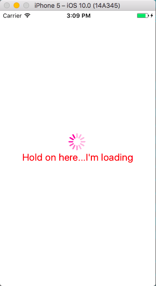
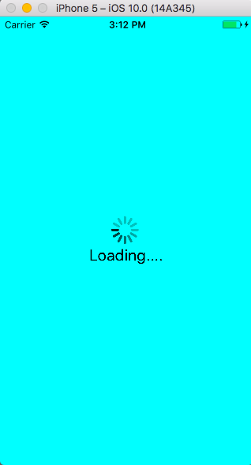

# RN-Loading-View

Just combines loading indicator with optional text into one.

* `npm install rn-loading-view --save`

<br>





```js
import React, { Component } from 'react';
import { View } from 'react-native';
import LoadingView from 'rn-search-bar';

class LoadingViewExampleOne extends Component {
  render(){
    return(
      <LoadingView
        size={'large'}
        animating={true}
        color={'deeppink'}
        text={'Hold on here...I\'m loading' }
        textStyle={{
          color: 'red',
          fontSize: 20,
        }}
      />
    )
  };

class LoadingViewExampleTwo extends Component {
  render(){
    return(
      <View style={{flex:1,backgroundColor:'cyan'}}>
        <LoadingView
          size={'large'}
          animating={true}
          color={'black'}
          text={'Loading....' }
          textStyle={{
            color: 'black',
            fontSize: 20,
          }}
        />
      </View>
    )
  };

}
```
