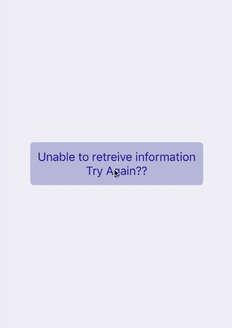

# RN-Loading-View
<a href="https://npmjs.org/package/rn-loading-view"></a>
<br>



Combines loading indicator with optional Text and Button into one component so you can quickly construct loading views

If the button is rendered via `renderButton={ true }` the ActivityIndicator and Text will not show.

* `npm install rn-loading-view --save`


```js
import React from 'react';
import LoadingView from 'rn-loading-view';
import { StyleSheet } from 'react-native';

const styles = StyleSheet.create({
  button: {
    padding:10,
    borderRadius:5,
    marginHorizontal:20,
    backgroundColor: 'rgba(0,0,255,.7)'
  },
  text: {
    fontSize:16,
    textAlign:'center',
    color:'blue'
  }
})

const spinnerProps = {size:'large',color:'rgba(0,0,255,.7)'}

class LoadingViewExample extends React.Component {
  render(){
    return(
        <LoadingView
          text={ 'Getting information...' }
          textProps={{ style: styles.text }}
          renderButton={ (some condition) ? true:false }
          spinnerProps={ spinnerProps }
          buttonText={ 'Try Again?' }
          buttonTextProps={{ style: styles.text }}
          buttonProps={{
            style: styles.button,
            onPress: () => console.log('do stuff')
          }}
        />
    )
  };

}
```
### Props

| Prop | Type | Description |
| ---  | ---  | ---         |
| spinnerProps | object | ActivityIndicator Props|
| text | string | text to display below the spinner |
| textProps | object |  Text Props |
| renderButton | boolean | render a button below the text |
| buttonText | string | text in the button |
| buttonTextProps | object | Text Props for button text |
| buttonProps | object | TouchableOpacity Props |
